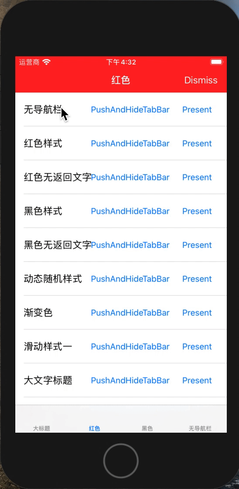

# BDNavigationBarTransition

[](https://travis-ci.org/451174332@qq.com/BDNavigationBarTransition)
[](https://cocoapods.org/pods/BDNavigationBarTransition)
[](https://cocoapods.org/pods/BDNavigationBarTransition)
[](https://cocoapods.org/pods/BDNavigationBarTransition)

## Example

To run the example project, clone the repo, and run `pod install` from the Example directory first.

## Requirements

## Installation

BDNavigationBarTransition is available through [CocoaPods](https://cocoapods.org). To install
it, simply add the following line to your Podfile:

```ruby
pod 'BDNavigationBarTransition'
```

## Screenshots

导航栏不同颜色切换
<p>
	
	
</p>

有导航栏切换到无导航栏
<p>
	
	
</p>

渐变色导航栏切换
<p>
	
	
</p>

导航栏滑动显示
<p>
	
</p>

<p>
	
</p>

## Usage

**1. Define your custom navigationbar style**

```swift
//CustomNavigationBarStyle.swift
extension CommonNavigationBarStyle {
    static var red: CommonNavigationBarStyle {
        let style = CommonNavigationBarStyle()
        style.barBackgroundColor = .red
        style.tintColor = .white
        return style
    }
    ...
}
```

**2. Create NavigationBarTransitionController**

Create `NavigationBarTransitionController` instance and call `navigationController(_:, willShow:, animated:)` method

```swift
//BaseNavigationController.swift
import BDNavigationBarTransition

class BaseNavigationController: UINavigationController, UINavigationControllerDelegate {
    private let transitionController = NavigationBarTransitionController()
    
    override func viewDidLoad() {
        super.viewDidLoad()
        // Set global default navigationbar style here
        transitionController.defaultNavigationBarStyle = CommonNavigationBarStyle.customDefault
        delegate = self
    }
    
    func navigationController(_ navigationController: UINavigationController, willShow viewController: UIViewController, animated: Bool) {
        transitionController.navigationController(navigationController, willShow: viewController, animated: animated)
    }
    ......
}

```

**3. Implement `CustomNavigationBar` protocol**

```swift
// RedNaviBarViewController.swift
class RedNaviBarViewController:  UIViewController, CustomNavigationBar {
    var navigationBarStyle: NavigationBarStyleProtocol = CommonNavigationBarStyle.red
    ......
}
```
or 

```
// RedNaviBarViewController.swift
extension RedNaviBarViewController: ViewControllerCustomNavigationBar {
    var navigationBarStyle: NavigationBarStyleProtocol {
        return CommonNavigationBarStyle.red
    }
}
```


## More

You can create your custom NavigationBarStyle by conforms to `NavigationBarStyleProtocol` and implement `refresh(_ navigationBar:, from:, to:)` method to decide how to display `navigationBar` 

## Author

dengliwenx@foxmail.com

## License

BDNavigationBarTransition is available under the MIT license. See the LICENSE file for more info.
